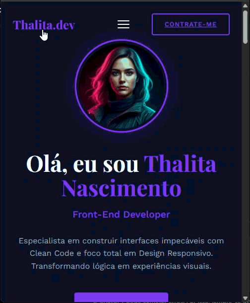

# Portfólio Pessoal

Projeto desenvolvido com HTML, CSS e JavaScript para apresentar minha trajetória profissional, habilidades técnicas, projetos desenvolvidos e evolução como desenvolvedora Front-End.

## Aplicação em Produção

🚧 Deploy em andamento.

## Demonstração

### Versão Desktop

### Versão Mobile

## Protótipo

O protótipo da interface foi desenvolvido no Figma.

🎨 https://www.figma.com/proto/ru4ieSioHsYkWkJhEj4h30/Prot%C3%B3tipo-Portf%C3%B3lio?node-id=3-955&t=HOaQX2C8vxaWExHP-1&starting-point-node-id=3%3A955

## Tecnologias Utilizadas

- HTML5
- CSS3
- JavaScript
- Git
- GitHub
- Figma
- OpenCode

## Como Executar o Projeto

1. Clone o repositório:

git clone https://github.com/tahlly/portfolio-pessoal.git

2. Entre na pasta:

cd portfolio-pessoal

3. Abra o arquivo index.html no navegador.

Ou utilize a extensão Live Server do VS Code.

## Status do Projeto

🚀 Versão MVP concluída

🔄 Melhorias e novas funcionalidades em desenvolvimento.

## Estrutura do Projeto

portfolio-pessoal/
├── index.html
├── css/
├── js/
├── screenshots/
│   ├── demo.gif
│   └── mobile.gif
└── README.md

## Autor

Thalita Bruna do Nascimento Silva
